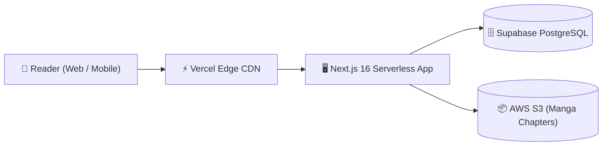

#  App-Mangify-Reader-2026 (Mangify)

<div align="center">

[](https://mangify-lime.vercel.app)
[](https://nextjs.org/)
[](https://react.dev/)
[](https://tailwindcss.com/)
[](https://supabase.com/)
[](https://aws.amazon.com/s3/)
[](LICENSE)

**เว็บแอปพลิเคชันอ่านมังงะและคอมมิคยุคใหม่ ออกแบบเพื่อประสบการณ์การอ่านที่สบายตาและลื่นไหลสูงสุด**  
*พัฒนาด้วย Next.js 16 (App Router), React 19, Tailwind CSS v4, AWS S3 และ Supabase พร้อม 4 ธีมถนอมสายตา*

[🌐 เข้าชมเว็บไซต์จริง (Live Demo)](https://mangify-lime.vercel.app) · [🐛 แจ้งปัญหา (Report Bug)](https://github.com/PhuriphatTyPeZ3r0/App-Mangify-Reader-2026/issues) · [✨ เสนอแนะฟีเจอร์ (Request Feature)](https://github.com/PhuriphatTyPeZ3r0/App-Mangify-Reader-2026/issues)

</div>

---

##  สารบัญ (Table of Contents)
- [📖 เกี่ยวกับโปรเจกต์ (About The Project)](#-เกี่ยวกับโปรเจกต์-about-the-project)
- [✨ ฟีเจอร์หลัก (Key Features)](#-ฟีเจอร์หลัก-key-features)
- [🎨 ระบบดีไซน์และธีมการอ่าน (Reader-Centric Design System)](#-ระบบดีไซน์และธีมการอ่าน-reader-centric-design-system)
- [🛠️ สถาปัตยกรรมและเทคโนโลยี (Tech Stack & Architecture)](#️-สถาปัตยกรรมและเทคโนโลยี-tech-stack--architecture)
- [📂 โครงสร้างโฟลเดอร์ (Directory Structure)](#-โครงสร้างโฟลเดอร์-directory-structure)
- [🚀 การติดตั้งและเริ่มต้นใช้งาน (Getting Started)](#-การติดตั้งและเริ่มต้นใช้งาน-getting-started)
- [🔐 การกำหนดค่า Environment Variables](#-การกำหนดค่า-environment-variables)
- [👨‍💻 ผู้พัฒนา (Author)](#-ผู้พัฒนา-author)

---

##  เกี่ยวกับโปรเจกต์ (About The Project)

> **ที่มาและปัญหา (Problem Statement):**  
> เว็บไซต์อ่านมังงะและคอมมิคทั่วไปมักมีโฆษณาแทรกกวนใจ ประสิทธิภาพการโหลดรูปภาพช้าบนเครือข่ายมือถือ และไม่มีระบบปรับโทนสีหน้าจอที่เหมาะสมกับการอ่านต่อเนื่องเป็นเวลานาน ทำให้เกิดอาการล้าสายตา (Eye Fatigue)

**แนวทางการแก้ไข (Solution):**  
**Mangify** ถูกออกแบบและพัฒนาขึ้นด้วยแนวคิด **Reader-First Experience**:
- หน้าต่างอ่านหนังสือแบบไร้สิ่งรบกวน (Distraction-Free Webtoon Reader)
- รองรับ 4 ธีมแสดงผลระดับสากล (Light, Sepia, Charcoal, Pure OLED Black)
- ระบบแคชรูปภาพประสิทธิภาพสูงผ่าน Cloudflare CDN และ AWS S3
- ติดตามประวัติการอ่านและบุ๊กมาร์กตอนโปรดแบบ Real-time บน Supabase

---

##  ฟีเจอร์หลัก (Key Features)

- [x] ⚡ **Smooth Infinite Scroll:** อ่านตอนต่อตอนได้ต่อเนื่องแบบ Webtoon ไม่มีสะดุด
- [x] 🎨 **4 Reader Display Themes:** สลับโทนสีได้ทันที (Milk White, Vintage Sepia, Cool Charcoal, Pure OLED)
- [x] 📱 **Fully Responsive Layout:** ออกแบบตามหลัก Mobile-First รองรับการแตะควบคุมและการปัดสัมผัส
- [x] 🔖 **Bookmark & Reading Progress:** บันทึกหน้าล่าสุดที่อ่านค้างไว้โดยอัตโนมัติ
- [x] ☁️ **High-Performance Asset Pipeline:** เสิร์ฟไฟล์มังงะผ่าน AWS S3 และ Image Optimization ของ Next.js
- [x] 🔍 **Fast Search & Genre Filtering:** ค้นหาชื่อเรื่อง ผู้แต่ง และหมวดหมู่ได้รวดเร็วทันใจ

---

##  ระบบดีไซน์และธีมการอ่าน (Reader-Centric Design System)

| ธีม (Theme) | โทนสีพื้นหลัง | วัตถุประสงค์ในการใช้งาน |
|---|:---:|---|
| **Light Mode** | `#faf8f5` (Soft Milk-White) | อ่านในที่แสงสว่างธรรมชาติ ลดแสงสะท้อนจ้า |
| **Sepia Mode** | `#f4ebd8` (Warm Paper) | จำลองผิวกระดาษหนังสือเล่มแบบคลาสสิก ถนอมสายตา |
| **Charcoal Mode** | `#1a1c23` (Cool Slate) | เหมาะสำหรับการอ่านตอนกลางคืน ลดแสงสีฟ้า |
| **OLED Black Mode** | `#000000` (Pure Black) | ดำสนิท ประหยัดพลังงานแบตเตอรี่บนหน้าจอ OLED/AMOLED |

- **Typography:** ฟอนต์ `Prompt` (Google Fonts) รองรับภาษาไทยและภาษาอังกฤษอย่างไร้รอยต่อ
- **Design Specifications:** รายละเอียดเพิ่มเติมสามารถศึกษาได้ที่ [DESIGN.md](./DESIGN.md)

---

##  สถาปัตยกรรมและเทคโนโลยี (Tech Stack & Architecture)

### 🎨 Frontend
- **Framework:** Next.js 16 (App Router)
- **Core Library:** React 19
- **Styling:** Tailwind CSS v4, Lucide React, Google Material Symbols
- **Typography:** Prompt (Google Fonts)

### ⚙️ Backend & Cloud Storage
- **Database & Auth:** PostgreSQL via Supabase
- **Cloud Storage:** AWS S3 (`@aws-sdk/client-s3`)
- **Hosting & Edge Delivery:** Vercel Edge Network
- **Automation / Scraping Pipeline:** Puppeteer with Stealth Plugin



---

##  โครงสร้างโฟลเดอร์ (Directory Structure)

```text
App-Mangify-Reader-2026/
├── src/
│   ├── app/                    # Next.js App Router Pages & API Endpoints
│   ├── components/             # Reusable UI & Reader Engine Components
│   │   ├── reader/             # Webtoon Reader Viewport & Controls
│   │   └── ui/                 # Buttons, Cards, Modals, Theme Switches
│   ├── lib/                    # Supabase Client, S3 Client & Utilities
│   └── styles/                 # Tailwind CSS v4 Theme Declarations
├── public/                     # Static Icons, PWA Manifest, Fonts
├── scripts/                    # Database Migrations & Automation Scripts
├── DESIGN.md                   # Complete Design System Specification
└── README.md                   # เอกสารแนะนำโปรเจกต์
```

---

##  การติดตั้งและเริ่มต้นใช้งาน (Getting Started)

### ข้อกำหนดเบื้องต้น (Prerequisites)
- [Node.js](https://nodejs.org/) (Version 18.x หรือ 20.x ขึ้นไป)
- Package Manager: `npm` หรือ `pnpm`

### ขั้นตอนการรันบนเครื่อง Local
1. **โคลน Repository:**
   ```bash
   git clone https://github.com/PhuriphatTyPeZ3r0/App-Mangify-Reader-2026.git
   cd App-Mangify-Reader-2026
   npm install
   ```

2. **กำหนดค่า Environment Variables:**
   ```bash
   cp env.example .env.local
   ```
   *(แก้ไขค่าต่างๆ ใน `.env.local`)*

3. **เริ่มรัน Development Server:**
   ```bash
   npm run dev
   ```
   เปิดเบราว์เซอร์ไปที่: `http://localhost:3000`

---

##  การกำหนดค่า Environment Variables

กำหนดค่าตัวแปรในไฟล์ `.env.local`:

```env
# Supabase Configuration
NEXT_PUBLIC_SUPABASE_URL=https://[YOUR_PROJECT_ID].supabase.co
NEXT_PUBLIC_SUPABASE_ANON_KEY=[YOUR_SUPABASE_ANON_KEY]

# AWS S3 Storage
AWS_ACCESS_KEY_ID=[YOUR_AWS_KEY]
AWS_SECRET_ACCESS_KEY=[YOUR_AWS_SECRET]
AWS_REGION=ap-southeast-1
AWS_S3_BUCKET_NAME=mangify-chapters
```

---

##  ผู้พัฒนา (Author)

**Phuriphat Hemakul (PhuriphatTyPeZ3r0)**
-  นักศึกษา สาขาวิศวกรรมคอมพิวเตอร์และปัญญาประดิษฐ์ (CAI)
-  สถาบันการจัดการปัญญาภิวัฒน์ (PIM)
-  GitHub: [@PhuriphatTyPeZ3r0](https://github.com/PhuriphatTyPeZ3r0)
-  Portfolio: [resume-phuriphat-hemakul.vercel.app](https://resume-phuriphat-hemakul.vercel.app)
